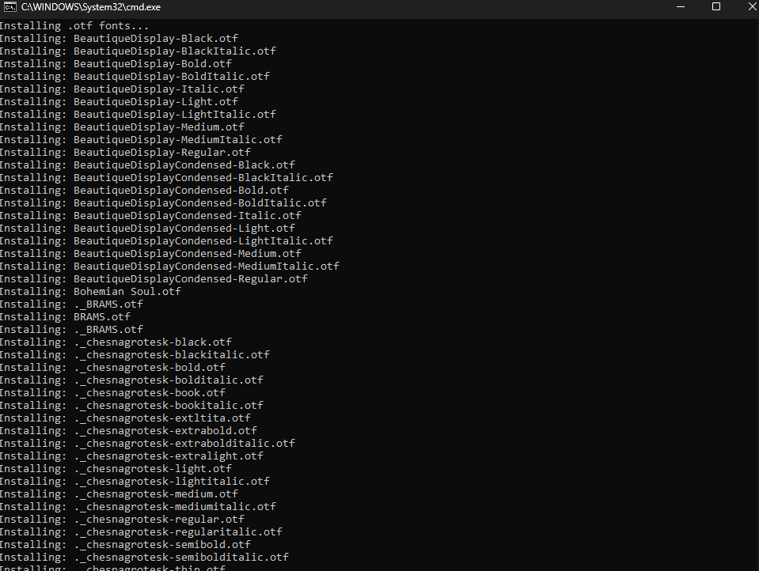
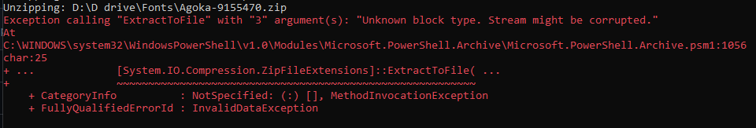
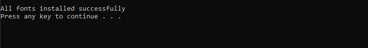

# Powershell-installFonts
Đây là file giúp bạn cài tất cả các font có trong một thư mục cùng một lúc. 

## 🧾 Hướng dẫn
Các bạn có thể tải file zip từ github về và unzip chúng. Mở file <strong>installFonts.bat<strong> bằng notepad và sửa đường dẫn đến thư mục chứa tất cả các fonts trong máy của bạn ở dòng sau.

```powershell
:: Thêm đường dân đến thư mục chứa font vào biến fontFolder
set "fontFolder=X:\Thư mục của bạn\..."
```



## 📛 Thông báo lỗi
Nếu bạn nhìn thấy lỗi này nghĩa là file zip này đã được bảo mật bằng mật khẩu, chúc mừng bạn phải unzip chúng bằng chuột. 🖱️



## ✅ Kiểm tra 
Để kiểm tra xem các fonts bạn đã cài đặt thành công trong máy hay chưa, các bạn vào đường dẫn thư mục như bên dưới. Hoạt động cho tất cả các máy Windows 10/11

```
C:\Windows\Fonts
```


## Lời kết
Chúc mừng các bạn đã tải thành công, hãy cho mình 1⭐ nếu thấy hữu ích


